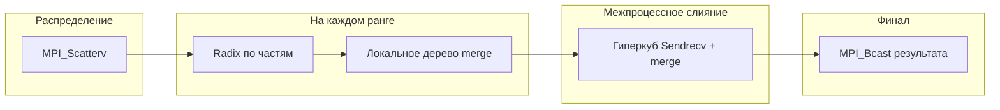

# Поразрядная сортировка целых чисел с простым слиянием (версия ALL: MPI + потоки)

**Вариант № 17**  
**Студент:** Соснина Александра Антоновна  
**Группа:** 3823Б1ПР1  
**Преподаватель:** Сысоев Александр Владимирович, доцент

---

## Назначение отчёта

Этот документ описывает **только** реализацию **`all`**: распределение данных между **MPI-процессами**, локальная многопоточная сортировка внутри каждого ранга и **межпроцессное** слияние. Общая теория radix LSD и последовательная схема SEQ изложены в `seq/report.md`; варианты OpenMP, TBB и STL — в соответствующих каталогах.

Подробные **таблицы замеров и формулы эффективности** для ALL вынесены в отдельный файл **`all/report_performance.md`**, чтобы не смешивать методику производительности с описанием алгоритма.

## Введение

Вариант **ALL** моделирует гибридный параллелизм: **курс MPI** (несколько процессов с раздельными адресными пространствами) плюс **потоки** внутри процесса для ускорения работы над локальным фрагментом. Такой стек типичен для кластерных приложений, где на каждом узле запускается несколько MPI-процессов и/или внутри процесса используется OpenMP или явные потоки.

В данной задаче локальная фаза сознательно **совпадает по структуре со STL-веткой**: `std::thread` и `ParallelForRange` для radix по частям и для пар на уровнях merge. Это упрощает сравнение: при **`P = 1`** (один MPI-процесс) разница по времени в основном сводится к накладным расходам **`MPI_Scatterv`** / **`MPI_Bcast`** и к тому, что данные проходят через фазу распределения даже на одной машине.

## Постановка задачи (в терминах ALL)

- Вход: глобальный вектор целых на ранге 0 (в тестах курса — согласно контракту задачи).
- Выход: тот же мультимножество значений, отсортированный по неубыванию; на всех рангах после `Bcast` хранится **полная** копия результата (требование функциональных тестов под `mpirun`).
- Ограничение валидации: вход не пустой (`ValidationImpl`).

## Связь с кодом

- Заголовок: `all/include/ops_all.hpp`, класс `SosninaATestTaskALL`.
- Реализация: `all/src/ops_all.cpp`.
- Зависимости: `<mpi.h>`, `ppc::util::GetNumThreads()`, `ppc::util::GetNumProc()` (число процессов задаётся инфраструктурой курса через окружение, см. `util`).

## Поток выполнения RunImpl (логические фазы)

1. **`MPI_Comm_rank` / `MPI_Comm_size`** — определить `mpi_rank`, `mpi_size`.
2. **`ComputeChunkParams`** — размеры непрерывных кусков `chunk_sizes[i]` и смещения `offsets[i]`; остаток `total_size % mpi_size` распределяется по **младшим** рангам (первые ранги получают на один элемент больше при необходимости).
3. **`MPI_Scatterv`** (`ScatterData`) — корень рассылает фрагменты; каждый ранг получает свой `local_data` фиксированного размера.
4. **`SortLocalStlParallel(local_data)`** — локально та же схема, что в `stl`: выбор `num_parts` по порогам (`kMinElementsPerPart`, `kLargeArrayThreshold`, …), параллельный radix по частям, дерево merge с `ParallelForRange` и `std::ranges::merge` в `SimpleMerge`.
5. Если **`mpi_size == 1`**: результат переносится в `data`, проверка `is_sorted`, выход **без** гиперкуба.
6. Иначе **`ParallelHypercubeMerge`** — для `step = 1, 2, 4, …` пока `step < mpi_size`: партнёр `partner = mpi_rank ^ step`; если партнёр валиден, **`ExchangeAndMerge`**: обмен размерами (`MPI_Sendrecv` `size_t`), обмен массивами `int`, слияние двух отсортированных последовательностей в **`MergeTwoSorted`** (ручной merge, эквивалентен по результату устойчивому слиянию при корректных предпосылках порядка ключей).
7. На ранге 0 в `data` попадает итоговый вектор; на остальных `data` очищается.
8. **`BcastSortedVector`** — сначала `MPI_Bcast` размера `n` (`size_t`), затем элементов `MPI_INT` с корня; остальные ранги выделяют буфер и получают полный отсортированный массив.
9. **`MPI_Barrier`** и финальная проверка **`std::ranges::is_sorted(data)`** на каждом ранге.

### Псевдокод (сводно)

```text
rank, size <- MPI_Comm_rank/size
Scatterv: локальный кусок local_data на каждом ранге
SortLocalStlParallel(local_data)   // потоки: GetNumThreads()

если size == 1:
    data <- local_data; проверка; конец

merged <- local_data
для step = 1, 2, 4, ... < size:
    partner <- rank XOR step
    если partner < size:
        Sendrecv размеров и массивов с partner
        merged <- MergeTwoSorted(мой_кусок, кусок_partner)

если rank == 0: data <- merged; иначе data <- пусто
Bcast(data)
Barrier; проверка is_sorted(data)
```

### Схема потока данных (P > 1)



## Переменные окружения

- **`PPC_NUM_THREADS`** — число потоков для локальной фазы (`GetNumThreads()`).
- **`PPC_NUM_PROC`** — число MPI-процессов (в сочетании с `mpirun -np P`).
- Рекомендуется выставлять **`OMP_NUM_THREADS`** в согласованное значение, если раннер или библиотеки читают его параллельно с тестами.

## Тестирование

- Функциональные тесты с типом **`all`** / **`mpi`** в курсе запускаются под **`mpirun`** (см. `scripts/run_tests.py`); без MPI соответствующие кейсы пропускаются.
- Набор из **48** статических массивов в `tests/functional/main.cpp` дополняется проверками эталона.
- После `Bcast` **каждый** ранг должен иметь полный корректный вектор — иначе проверки на ненулевых рангах не пройдут.

## Производительность

Краткие выводы и **численные таблицы** (время `task_run`, ускорение, эффективность в процентах, команды воспроизведения) приведены в **`all/report_performance.md`**. Сводное сравнение всех технологий — в **`report_performance.md`** в корне каталога задачи.

## Ограничения и интерпретация замеров

- При **`P = 1`** гиперкуб не выполняется; измеряется в основном «STL-подобная» работа плюс MPI-обвязка.
- При **`P > 1` на одном физическом узле** процессы конкурируют за ядра и память с потоками соседних рангов; ускорение по «чистому» многопоточному STL может **не** добавляться линейно.
- Для честной оценки ALL на кластере нужны замеры при **нескольких узлах** и согласованной политикой размещения процессов.

## Вывод

Реализация ALL сочетает MPI для **разделения данных** и **глобального merge** с явной многопоточностью для **локальной** сортировки, проходит функциональные тесты под `mpirun` и служит учебным примером гибридного параллелизма.

## Источники

1. Курс «Параллельное программирование» (MPI, гибридные модели).
2. [MPI Forum](https://www.mpi-forum.org/) — `MPI_Scatterv`, `MPI_Sendrecv`, `MPI_Bcast`, `MPI_Barrier`.
3. [cppreference: std::thread](https://en.cppreference.com/w/cpp/thread/thread).
4. Локальный отчёт по замерам: `all/report_performance.md`.
